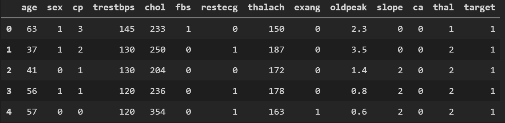
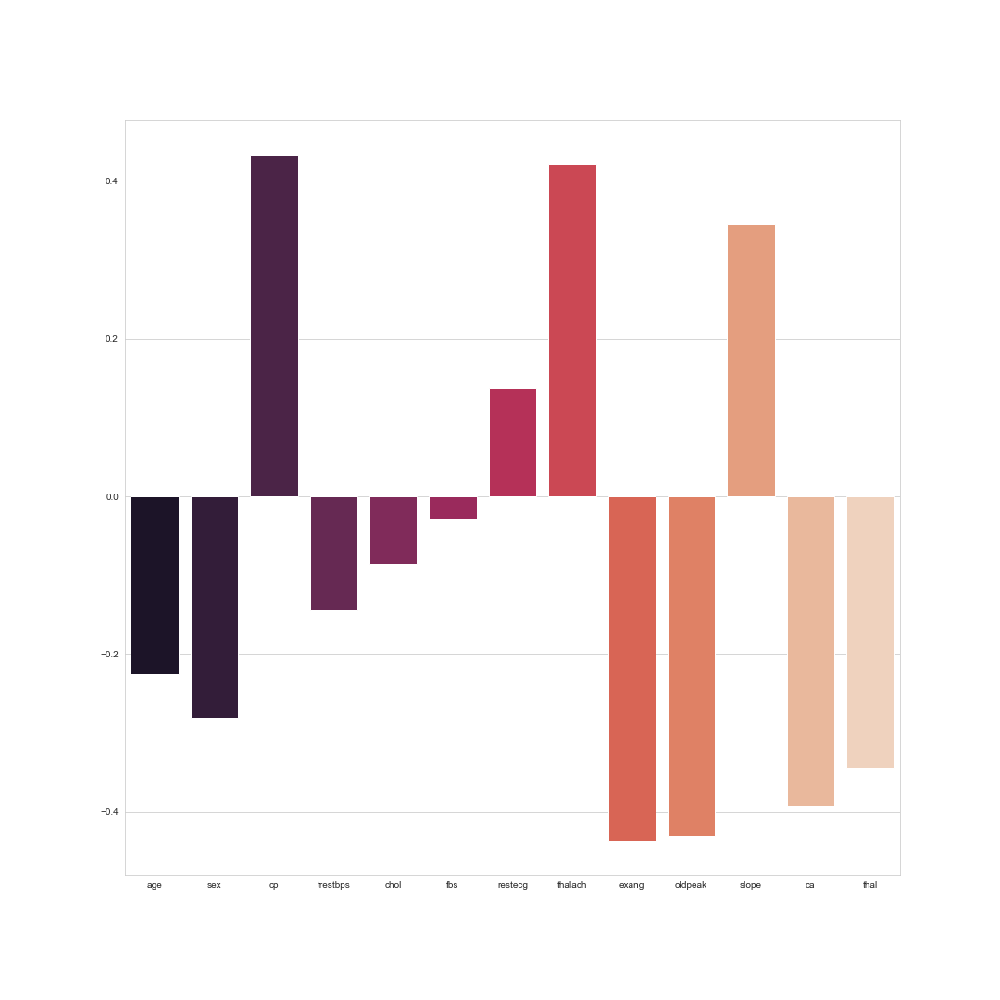
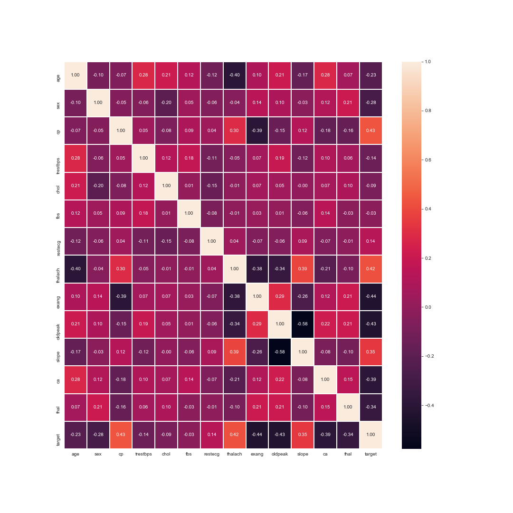

# Heart-Disease-Prediction
Predicting heart disease, written in Python 3.6

Dataset is taken from UCI database: https://archive.ics.uci.edu/ml/datasets/heart+disease

Is it containing 14 attributes related to heart's performance:

Script contains analysis of correlation between those attributes with heart disease and a correlation matrix:

Three methods of classifiers are being used:
* Naive Bayes
* SVC
* Random forest
